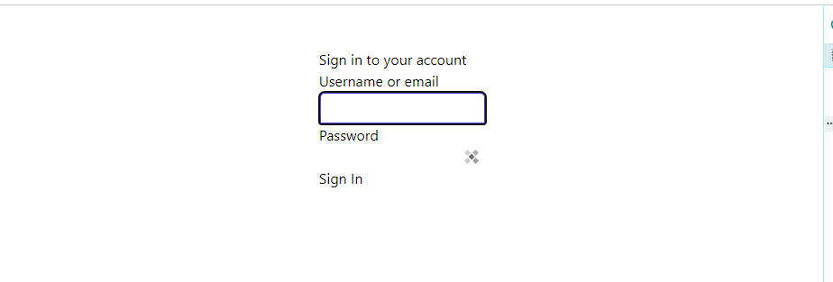

# Customization Theme
Here you can see how to customize your keycloak theme
## Manual
Clone 'base-theme'
Rename with your name

Add volume in docker-compose configuration
- ./PATH-THEME/NAME-FOLDER-THEME/:/opt/keycloak/themes/NAME-THEME/

NAME-THEME is the label you want to see in dashboard configuration

example:
``` yml
volumes:
  - ./customization-theme/vanilla-theme/:/opt/keycloak/themes/vanilla-theme/
```

### Add Tailwind

install tailwind
``` sh
    npm install tailwind tailwind-direction @tailwindcss/forms
```

init tailwind
``` sh
npx tailwindcss init
```

### creation input output style files

create input.css file in /src/input.css
create asset folder in /login/resource/asset

create scripti in package.json
``` json
  "scripts": {
    "style": "npx tailwindcss -i ./src/input.css -o ./login/resources/assets/output.css --watch",
  },
```
if you change input/output style files name or folder's path, update script

run script
``` sh
npm run style
```

### modify theme.properties
modify theme.properties to add output.css
``` properties
parent=base

styles=assets/output.css
```

### add tailwind class

template.ftl
``` html
<body>
  <div class="flex min-h-full flex-1 items-center justify-center px-4 py-12 sm:px-6 lg:px-8">

...
```

login.ftl
``` html
  <input 
      tabindex="1" 
      id="username"
      class="relative block w-full rounded-t-md border-0 py-1.5 text-gray-900 ring-1 ring-inset ring-gray-100 placeholder:text-gray-400 focus:z-10 focus:ring-2 focus:ring-inset focus:ring-indigo-600 sm:text-sm sm:leading-6" 
      name="username" value="${(login.username!'')}" 
      type="text" 
      autofocus autocomplete="off"
      aria-invalid="<#if messagesPerField.existsError('username','password')>true</#if>"
  />
...
```

and see result


