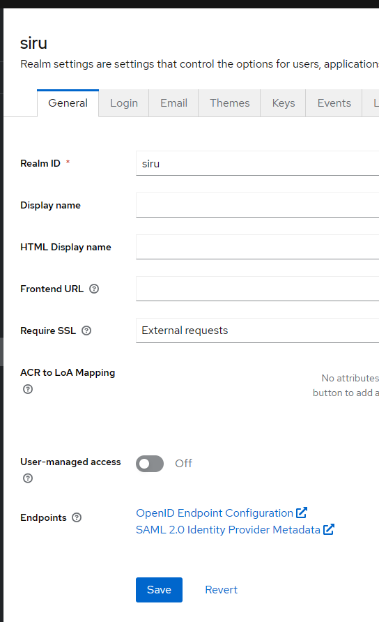

[back-setup](./setup.md)

[back-home](../README.md)

### Start vs Start-dev
<b>start</b>
Questo comando è utilizzato per avviare Keycloak in modalità standard, ottimale per la modalità di produzione. Infatti, una volta avviato, puoi accedere alla pagina di configurazione solo tramite https://localhost:8443


<b>start-dev</b>
Questo comando è specificamente progettato per l'ambiente di sviluppo


### Trovare i link nel REALM

Se avete cambiato il nome del realm e dovete trovare i link giusti bisogna seguire i seguenti passi.

1) Andare in questo link del
[Realm-Settings](http://localhost:8090/admin/master/console/#/siru/realm-settings) http://localhost:8090/admin/master/console/#/NOME_DEL_REALM/realm-settings

2) Aprire il link OpenID Endpoint Configuration
Nel nostro caso sarà [questo](http://localhost:8090/realms/siru/.well-known/openid-configuration)


3) L'url risponde con un JSON di questo tipo e il campo che ci interessa è 'authorization_endpoint'.
In alcune librerie è utile solo il campo 'issuer'. Questo perché grazie alla chiamata .well-know/openid-configuration si possono conoscere tutti gli endpoint per i vari utilizzi. 

```json
{
    "issuer": "http://localhost:8090/realms/siru",
    "authorization_endpoint": "http://localhost:8090/realms/siru/protocol/openid-connect/auth",
    "token_endpoint": "http://localhost:8090/realms/siru/protocol/openid-connect/token",
    "introspection_endpoint": "http://localhost:8090/realms/siru/protocol/openid-connect/token/introspect",
    "userinfo_endpoint": "http://localhost:8090/realms/siru/protocol/openid-connect/userinfo",
    "end_session_endpoint": "http://localhost:8090/realms/siru/protocol/openid-connect/logout",
    "frontchannel_logout_session_supported": true,
    "frontchannel_logout_supported": true,

    ...
}

```

