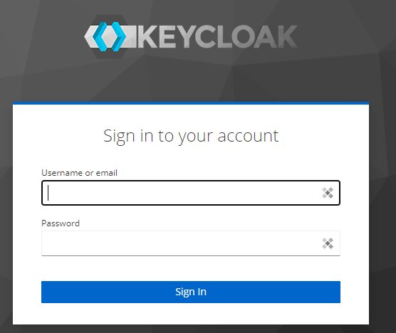

[back](../README.md)

## Ispezione del DB

Open PGAdmin http://localhost:5050/

inserisci i valori che trovi nel docker-compose in PGADMIN_DEFAULT_EMAIL e PGADMIN_DEFAULT_PASSWORD

nella home clicca su 'Add new Server' e nel tab connection aggiungi i seguenti campi

Attenzione che 'hostname' coincida con il nome del service nel docker-compose 

Se si usa DBeaver la connessione è uguale ma con 'localhost' nell'hostname. Si consiglia una porta diversa dalla 5432 per non andare in conflitto con porte già esistenti nel vostro pc.

Ad ogni modo dovreste vedere le tabelle che keycloak tira su.

## Primo login keycloak

aprire localhost:8090

cliccare su 'Administration Console'

Inserire username e password presenti nel docker-compose nei campi KEYCLOAK_ADMIN e KEYCLOAK_ADMIN_PASSWORD

Una volta fatta la login, dovremo creare il primo REALM

Poi creiamo il primo client

impostiamo un nome del client
lasciamo le configurazioni così come sono di default

nella parte di login inserire questo http://localhost:8081 sia in Root Url sia in Valid Redirect
