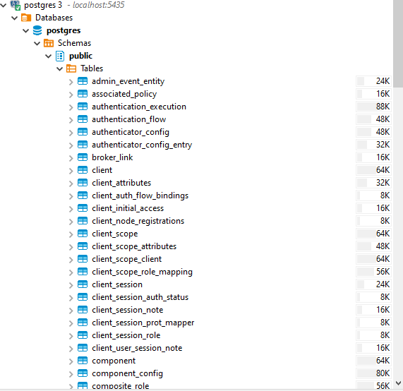
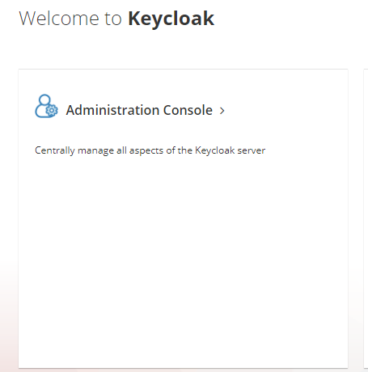
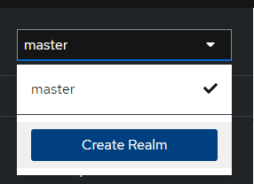
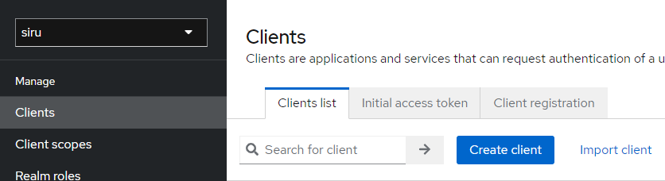

[back](../README.md)

# Get Started
Per iniziare abbiamo bisogno di Keycloak.

## Docker
Per avviare Keycloak tramite Docker devi assicurati di avere docker installato nel tuo pc/macchina virtuale. 

- [Windows](https://docs.docker.com/desktop/install/windows-install/)
- [WSL](https://dev.to/bowmanjd/install-docker-on-windows-wsl-without-docker-desktop-34m9)
- [Mac](https://docs.docker.com/desktop/install/mac-install/)
- [Linux](https://docs.docker.com/desktop/install/linux-install/)

### Docker Run
Una volta installato docker avviamo l'immagine con le seguenti proprietà

``` bash
docker run -p 8090:8080 -e KEYCLOAK_ADMIN=admin -e KEYCLOAK_ADMIN_PASSWORD=admin quay.io/keycloak/keycloak:23.0.3 start-dev

```

### Docker Compose
Abbiamo anche preparato un docker compose

``` bash
docker compose -f "docker-compose.yml" up -d --build
```

## JAVA
Per avviare il server Keycloak direttamente dai compilati conviena, assicurati di avere OpenJDK installato e la variabile JAVA_HOME configurata.  
- [Windows](https://learn.microsoft.com/en-us/java/openjdk/install)
- [All](https://openjdk.org/install)
- [JAVA_HOME](https://www.baeldung.com/java-home-on-windows-7-8-10-mac-os-x-linux)

### OpenJDK
- Scarica ed estrai l'[ultima versione](https://github.com/keycloak/keycloak/releases/download/23.0.3/keycloak-23.0.3.zip) dal sito di Keycloak keycloak-23.0.3.zip from the Keycloak website.

[Keycloak 23](https://www.keycloak.org/archive/downloads-23.0.3.html)
[Archivio] (https://www.keycloak.org/downloads-archive.html)
- Entra nella directory: /esempio keycloak-23.0.3
- Avvio
- - Per sistemi Unix/Linux ``` bin/kc.sh start-dev ```
- - Per sistemi Windows ``` bin\kc.bat start-dev ```

Per capire meglio 'start-dev' vedi l'approfondimento su [Curiosity](./curiosity.md)

## Ispezione del DB

Open PGAdmin http://localhost:5050/

inserisci i valori che trovi nel docker-compose in PGADMIN_DEFAULT_EMAIL e PGADMIN_DEFAULT_PASSWORD

nella home clicca su 'Add new Server' e nel tab connection aggiungi i seguenti campi


Attenzione che 'hostname' coincida con il nome del service nel docker-compose 

Se si usa DBeaver la connessione è uguale ma con 'localhost' nell'hostname. Si consiglia una porta diversa dalla 5432 per non andare in conflitto con porte già esistenti nel vostro pc.


Ad ogni modo dovreste vedere le tabelle che keycloak tira su.




## Primo login keycloak

Aprire localhost:8090
P.S. Se avete configurato una porta diversa aprite la pagina in una porta differente. 

cliccare su 'Administration Console'



Inserire username e password presenti nel docker-compose nei campi KEYCLOAK_ADMIN e KEYCLOAK_ADMIN_PASSWORD


Una volta fatta la login, dovremo creare il primo REALM.

Se volete mantenere le configurazioni dei workshop chiamate il REALM 

```
siru
```



Poi creiamo il primo client
Se volete mantenere le configurazioni dei workshop chiamate il REALM 

```
siru-fe
```



impostiamo un nome del client
lasciamo le configurazioni così come sono di default

nella parte di login inserire questo http://localhost:8081 sia in Root Url sia in Valid Redirect

