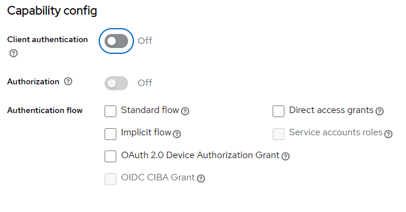

[back-home](../README.md)

## Configurazioni

Utilizziamo HTML, JS e Postman per conoscere il significato delle configurazioni base del client di keycloak

## Cosa fare?
- avviamo Keycloak [vedi-setup](./setup.md)
- entriamo nella cartella workshop-1-configuration
- eseguiamo solo una volta
``` npm i ```
- poi facciamo partire il server che espone la pagina statica 
``` npm start ```. Tools utilizzato: 
[http-server](https://github.com/http-party/http-server)

## Consigli
Per limitare i problemi più comuni consigliamo di:
- utilizzare browser differenti tra la paginadi Configurazione e la pagina di Login.
- di utilizzare il browser con i CORS disabilitati

Pagina di Configurazione Keycloak: http://localhost:8090 

Pagina di login: http://localhost:8081

## Configurazioni Keycloak
A questo punto apriamo [Keycloak-Admin](http://localhost:8090) e andiamo a creare o configurare un client. Se volete mantenere le stesse configurazioni del workshop chiamate il client 'siru-fe'.

Se non è ancora presente, creiamo un primo utente.

Apriamo in un altro browser la pagina di workshop [pagina](http://localhost:8081)

Ora apriamo la pagina index.html e andiamo a inserire i campi in questo punto: 

```js

// URL dell'endpoint di autorizzazione
const authorizationEndpoint = 'http://localhost:8090/realms/siru/protocol/openid-connect/auth'; 
// ClientId
const clientId = 'siru-fe';
// Url di redirect
const redirect = 'http://localhost:8081';

// scope
const scope = 'openid profile email';
// Response Type
const responseType = 'code token';

```

I primi tre campi (authorizationEndpoint, clientId, redirect) vanno configurati solo una volta. 

authorizationEndpoint: rappresenta l'url del server keycloak a cui verrà reindirzzata la pagina web per fare la login.

oppure cercare il il campo '

clientId: è il nome del client che abbiamo creato precedentemente. Se avete usato un nome custom, qui va cambiato

#### Ma perché stiamo usando vanilla javascript? nemmeno Typescript?
La ragione principale per cui iniziamo a conoscere Keycloak attraverso una pagina HTML+JS è perché qualsiasi libreria o framework che andremo a utilizzare successivamente, che ci faciliterà il lavoro, si basa su due/tre chiamate che devono essere fatte passando determinati valori.

Sfruttiamo una pagina html per capire il meccanismo di redirect in Keycloak per effetture la login. 
Le api più complesse le eseguiamo con Postman

## Configurazione tipo di flusso di autenticazione
Per configurare il tipo di autenticazione bisogna andare nella sezione 'Capability config' dove ci sono queste opzioni:




## Standard Flow
Questa opzione abilita 'Authorization Code Flow'. Significa che per ottenere un token dovremo scambiare un codice, il code. 

Quindi
- clicchiamo su 'genera URL'
- vediamo l'url generato
- clicchiamo su 'clicca qui per effettuare la login'
- veniamo reindirizzati sulla pagina di keycloak. 
- effettuiamo la login
- e poi verremo reindirizzati nella pagina

Notiamo che nell'url di ritorno abbiamo dei parametri
```
http://localhost:8081/?state=kxXm9rC72G75ktp8&session_state=2822ce0d-35dc-45df-bb95-935e2990556c&code=bf8ccee9-61df-4e1e-98ca-b0d4aacfe5b8.2822ce0d-35dc-45df-bb95-935e2990556c.d637b91c-e09e-4bd0-97ee-0567f82d6a4d
```
state
session-state
code

In questo momento siamo correttamente loggati.
Per ottenere il token dovremo effettuare una chiamata post di questo tipo

```
 POST /token Content-Type: application/x-www-form-urlencoded  grant_type=authorization_code&code=AUTHORIZATION_CODE&redirect_uri=YOUR_REDIRECT_URI&client_id=YOUR_CLIENT_ID&client_secret=YOUR_CLIENT_SECRET
 
```
``` bash
curl --location 'http://localhost:8090/realms/siru/protocol/openid-connect/token' \
--header 'Content-Type: application/x-www-form-urlencoded' \
--data-urlencode 'grant_type=authorization_code' \
--data-urlencode 'client_id=siru-fe' \
--data-urlencode 'code=cd8e2638-2303-448a-b339-03d11890c8a5.2822ce0d-35dc-45df-bb95-935e2990556c.d637b91c-e09e-4bd0-97ee-0567f82d6a4d' \
--data-urlencode 'redirect_uri=http://localhost:8081'
```

Fatta uesta configurazione i parametri da mettere nell'url sono

Implicit Flow

Direct Access Grants
Abilita il Resource Owner Password Credentials Grant, ovvero che basta avere username e password per ottenere il token

``` bash
curl --location 'http://localhost:8090/realms/siru/protocol/openid-connect/token' \
--header 'Content-Type: application/x-www-form-urlencoded' \
--data-urlencode 'grant_type=password' \
--data-urlencode 'client_id=siru-fe' \
--data-urlencode 'username=michele' \
--data-urlencode 'password=admin'
```

This enables support for Direct Access Grants, which means that client has access to username/password of user and exchange it directly with Keycloak server for access token. In terms of OAuth2 specification, this enables support of 'Resource Owner Password Credentials Grant' for this client.

Service Accounts Roles

```bash
curl --location 'http://localhost:8090/realms/siru/protocol/openid-connect/token' \
--header 'Content-Type: application/x-www-form-urlencoded' \
--data-urlencode 'grant_type=client_credentials' \
--data-urlencode 'client_id=siru-fe' \
--data-urlencode 'username=michele' \
--data-urlencode 'password=admin' \
--data-urlencode 'client_secret=CNNxQx7MRsVF3x4oxErCFvYyv3fu8zoK' \
--data-urlencode 'scope=openid profile email'
```

Client authentication

